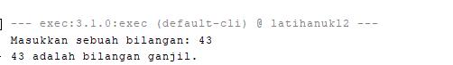

# 🔢 Program Pengecekan Bilangan Ganjil atau Genap

## 📝 Penjelasan Singkat
Program ini digunakan untuk menentukan apakah sebuah bilangan termasuk **ganjil** atau **genap**.  
Pengguna hanya perlu memasukkan satu angka, lalu program akan otomatis menampilkan hasilnya.

Kalau pengguna tidak sengaja mengetik huruf atau karakter lain (bukan angka), program juga sudah dilengkapi **penanganan error (exception handling)** agar tidak crash.  
Sebagai gantinya, akan muncul pesan peringatan yang sopan seperti:
> "Input tidak valid! Harap masukkan angka bulat."

Dengan begitu, program jadi lebih aman dan ramah pengguna.

---

## ⚙️ Fungsi Program
1. **Meminta input angka dari pengguna.**  
2. **Memeriksa apakah angka tersebut habis dibagi 2.**  
   - Jika iya → program menampilkan bahwa angka itu **genap**.  
   - Jika tidak → program menampilkan bahwa angka itu **ganjil**.  
3. Jika pengguna memasukkan input yang bukan angka, program akan menampilkan **pesan kesalahan** tanpa menghentikan eksekusi secara tiba-tiba.

---.

## 📷 Screenshot Hasil Program
Berikut tampilan hasil saat program dijalankan:

